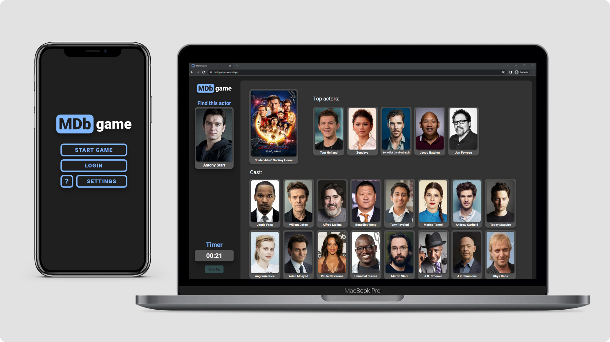

# MDBGames

DESCRIPTION

<p align="center">
  
</p>

## Developed with...

- **React** - A JavaScript library for building user interfaces.
- **Firebase** - Google platform used to provide OAuth.
- **Cloud Firestore** - Real-Time Cloud database from Google.

## Getting started

1. Clone the repo

```
git clone https://github.com/YourUsername/MDBGames
cd MDBGames/mdbgame
```

2. Install dependencies

```
npm install
```

3. Fill out your API keys

```
    // Create a .env file inside the /scr folder with:
      REACT_APP_API_IMAGE = ""
      REACT_APP_API_KEY = ""
      REACT_APP_FIREBASE_APIKEY = ""
      REACT_APP_FIREBASE_AUTHDOMAIN = ""
      REACT_APP_FIREBASE_PROJECTID = ""
      REACT_APP_FIREBASE_STORAGEBUCKET = ""
      REACT_APP_FIREBASE_MESSAGINGSENDERID = ""
      REACT_APP_FIREBASE_APPID = ""
      REACT_APP_FIREBASE_MEASUREMENTID = ""
```

4. Start development server

```
npm start
```

## What makes MDBGames different

- ### One of a kind app
  - First web to let users play through a movie database to their skills.

- ### Fully Developed in React
  - Able to work on web for desktop and mobile.
  - Create an account to get the full experience.

- ### Show your skills
  - Profile with the user's stats.
  - Users can set highscores for every path played.
